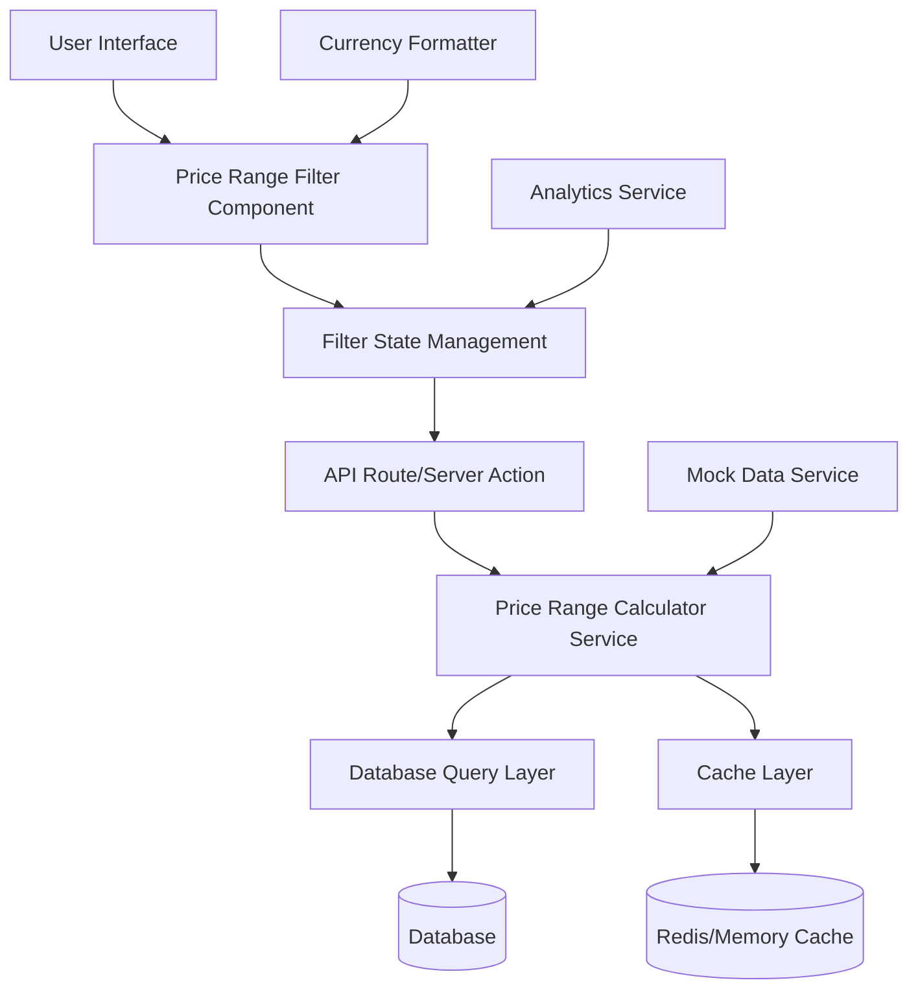

# Design Document

## Overview

The dynamic price range filter system will replace the existing hardcoded price range implementation with an intelligent, data-driven approach. The system will analyze the actual price distribution of search results and generate 8 meaningful price ranges using statistical methods (quantiles/clustering). The solution leverages Next.js App Router for optimal performance, implements server-side computation with caching, and provides a responsive, accessible UI.

## Architecture

### High-Level Architecture



### System Flow

1. **Initial Load**: User performs search → API calculates price ranges → Cache results → Return to UI
2. **Filter Selection**: User selects ranges → Update URL state → Filter results → Update UI
3. **Search Change**: New search parameters → Invalidate cache → Recalculate ranges → Update UI

## Components and Interfaces

### Core Services

#### 1. Price Range Calculator Service

```typescript
interface PriceRangeCalculator {
  calculateRanges(prices: number[], productType: ProductType): PriceRange[];
  validatePrices(prices: number[]): number[];
  roundPrice(price: number, productType: ProductType): number;
}

interface PriceRange {
  id: string;
  minPrice: number;
  maxPrice: number;
  count: number;
  label: string;
}

enum ProductType {
  HOUSE = "house",
  TOY = "toy",
  ELECTRONICS = "electronics",
  GENERAL = "general",
}
```

**Algorithm Implementation:**

- **Quantile-based approach**: Divide sorted prices into 8 equal-sized groups using octiles
- **Clustering fallback**: Use k-means clustering for non-uniform distributions
- **Rounding logic**: Product-specific rounding (R10K for houses, $10 for toys, $100 for electronics)
- **Edge case handling**: Fewer ranges for similar prices, minimum range validation

#### 2. Cache Service

```typescript
interface CacheService {
  get(key: string): Promise<PriceRange[] | null>;
  set(key: string, ranges: PriceRange[], ttl: number): Promise<void>;
  invalidate(pattern: string): Promise<void>;
  generateKey(searchParams: SearchParams): string;
}

interface SearchParams {
  category: string;
  location?: string;
  condition?: string;
  [key: string]: any;
}
```

**Caching Strategy:**

- **Key generation**: Hash of search parameters (category + location + filters)
- **TTL**: 1 hour for dynamic ranges, 24 hours for static categories
- **Invalidation**: Clear cache when new listings are added/updated
- **Fallback**: Return cached ranges if calculation fails

#### 3. Database Query Service

```typescript
interface DatabaseService {
  getPricesForSearch(params: SearchParams): Promise<number[]>;
  getFilteredResults(
    params: SearchParams,
    priceRanges: PriceRange[]
  ): Promise<SearchResult[]>;
  getPriceStatistics(params: SearchParams): Promise<PriceStatistics>;
}

interface PriceStatistics {
  min: number;
  max: number;
  median: number;
  count: number;
  percentiles: number[];
}
```

**Query Optimization:**

- Use database aggregation functions for statistics
- Index on price, category, location fields
- Batch queries to reduce round trips
- Pagination support for large result sets

### Frontend Components

#### 1. Dynamic Price Range Filter Component

```typescript
interface PriceRangeFilterProps {
  searchParams: SearchParams;
  productType: ProductType;
  currency: Currency;
  onRangeSelect: (ranges: string[]) => void;
  selectedRanges: string[];
  className?: string;
}

interface Currency {
  code: string; // 'ZAR', 'USD'
  symbol: string; // 'R', '$'
  locale: string; // 'en-ZA', 'en-US'
}

// Functional component implementation
export function PriceRangeFilter({
  searchParams,
  productType,
  currency,
  onRangeSelect,
  selectedRanges,
  className
}: PriceRangeFilterProps) {
  const { ranges, isLoading, error } = usePriceRanges(searchParams, productType);
  const { handleError, retry, clearError } = usePriceRangeError();

  const handleRangeToggle = useCallback((rangeId: string) => {
    const newSelection = selectedRanges.includes(rangeId)
      ? selectedRanges.filter(id => id !== rangeId)
      : [...selectedRanges, rangeId];
    onRangeSelect(newSelection);
  }, [selectedRanges, onRangeSelect]);

  const handleClearAll = useCallback(() => {
    onRangeSelect([]);
  }, [onRangeSelect]);

  if (error && !error.recoverable) {
    return <ErrorMessage error={error} onRetry={() => retry()} />;
  }

  return (
    <div className={className}>
      {/* Component JSX implementation */}
    </div>
  );
}

// Custom hook for price ranges data fetching
function usePriceRanges(searchParams: SearchParams, productType: ProductType) {
  const [ranges, setRanges] = useState<PriceRange[]>([]);
  const [isLoading, setIsLoading] = useState(false);
  const [error, setError] = useState<PriceRangeError | null>(null);

  useEffect(() => {
    // Fetch price ranges logic
  }, [searchParams, productType]);

  return { ranges, isLoading, error };
}
```

**Component Features:**

- Functional component with React hooks
- Checkbox-based range selection
- Clear filters functionality
- Loading states during recalculation
- Responsive design for mobile/desktop
- Accessibility compliance (ARIA labels, keyboard navigation)

#### 2. Filter State Management with Hooks

```typescript
interface FilterState {
  selectedPriceRanges: string[];
  availableRanges: PriceRange[];
  isLoading: boolean;
  error: PriceRangeError | null;
}

// Zustand store for global filter state
interface FilterStore extends FilterState {
  selectRange: (rangeId: string) => void;
  deselectRange: (rangeId: string) => void;
  clearAllRanges: () => void;
  updateAvailableRanges: (ranges: PriceRange[]) => void;
  setLoading: (loading: boolean) => void;
  setError: (error: PriceRangeError | null) => void;
}

// Custom hook for filter state management
function useFilterState() {
  const store = useFilterStore();
  const [searchParams, setSearchParams] = useSearchParams();

  // Sync with URL parameters
  useEffect(() => {
    const priceParam = searchParams.get("price");
    if (priceParam) {
      const ranges = priceParam.split(",");
      store.updateSelectedRanges(ranges);
    }
  }, [searchParams]);

  // Debounced URL update
  const debouncedUpdateURL = useMemo(
    () =>
      debounce((ranges: string[]) => {
        const params = new URLSearchParams(searchParams);
        if (ranges.length > 0) {
          params.set("price", ranges.join(","));
        } else {
          params.delete("price");
        }
        setSearchParams(params);
      }, 300),
    [searchParams, setSearchParams]
  );

  const selectRange = useCallback(
    (rangeId: string) => {
      store.selectRange(rangeId);
      debouncedUpdateURL([...store.selectedPriceRanges, rangeId]);
    },
    [store, debouncedUpdateURL]
  );

  return {
    ...store,
    selectRange,
    // ... other methods
  };
}

// Zustand store implementation
const useFilterStore = create<FilterStore>((set, get) => ({
  selectedPriceRanges: [],
  availableRanges: [],
  isLoading: false,
  error: null,

  selectRange: (rangeId) =>
    set((state) => ({
      selectedPriceRanges: [...state.selectedPriceRanges, rangeId],
    })),

  deselectRange: (rangeId) =>
    set((state) => ({
      selectedPriceRanges: state.selectedPriceRanges.filter(
        (id) => id !== rangeId
      ),
    })),

  clearAllRanges: () => set({ selectedPriceRanges: [] }),

  updateAvailableRanges: (ranges) => set({ availableRanges: ranges }),

  setLoading: (loading) => set({ isLoading: loading }),

  setError: (error) => set({ error }),
}));
```

**State Management Strategy:**

- Use Zustand store for global filter state
- Custom hooks for component-level state logic
- Sync with URL parameters for shareability using useSearchParams
- Debounce filter changes to prevent excessive API calls
- Optimistic updates for better UX

## Data Models

### Database Schema Extensions

```sql
-- Add indexes for price filtering performance
CREATE INDEX idx_listings_price_category ON listings(price, category);
CREATE INDEX idx_listings_price_location ON listings(price, location);
CREATE INDEX idx_listings_category_location_price ON listings(category, location, price);

-- Add price statistics materialized view for caching
CREATE MATERIALIZED VIEW price_statistics AS
SELECT
  category,
  location,
  MIN(price) as min_price,
  MAX(price) as max_price,
  PERCENTILE_CONT(0.5) WITHIN GROUP (ORDER BY price) as median_price,
  COUNT(*) as total_count,
  ARRAY_AGG(PERCENTILE_CONT(i/8.0) WITHIN GROUP (ORDER BY price)) as octiles
FROM listings
WHERE price IS NOT NULL AND price > 0
GROUP BY category, location;
```

### TypeScript Interfaces

```typescript
interface Listing {
  id: string;
  price: number;
  category: string;
  location: string;
  currency: string;
  title: string;
  // ... other fields
}

interface PriceRangeRequest {
  searchParams: SearchParams;
  productType: ProductType;
  forceRecalculate?: boolean;
}

interface PriceRangeResponse {
  ranges: PriceRange[];
  statistics: PriceStatistics;
  cacheKey: string;
  calculatedAt: Date;
}
```

## Error Handling

### Custom Error Classes and Hooks

```typescript
// Custom error class for price range operations
export class PriceRangeError extends Error {
  constructor(
    message: string,
    public code: ErrorCode,
    public context?: Record<string, any>,
    public recoverable: boolean = true
  ) {
    super(message);
    this.name = "PriceRangeError";
  }
}

enum ErrorCode {
  CALCULATION_FAILED = "CALCULATION_FAILED",
  INVALID_DATA = "INVALID_DATA",
  CACHE_ERROR = "CACHE_ERROR",
  DATABASE_ERROR = "DATABASE_ERROR",
  NO_RESULTS = "NO_RESULTS",
}

// Custom hook for error handling in functional components
function usePriceRangeError() {
  const [error, setError] = useState<PriceRangeError | null>(null);
  const [fallbackRanges, setFallbackRanges] = useState<PriceRange[]>([]);
  const [isRetrying, setIsRetrying] = useState(false);

  const handleError = useCallback((error: PriceRangeError) => {
    setError(error);
    console.error("Price Range Error:", error);

    if (error.recoverable) {
      loadFallbackRanges().then(setFallbackRanges);
    }
  }, []);

  const retry = useCallback(
    async (retryFn: () => Promise<void>) => {
      setIsRetrying(true);
      try {
        await retryFn();
        setError(null);
      } catch (err) {
        if (err instanceof PriceRangeError) {
          handleError(err);
        }
      } finally {
        setIsRetrying(false);
      }
    },
    [handleError]
  );

  const clearError = useCallback(() => {
    setError(null);
    setFallbackRanges([]);
  }, []);

  return { error, fallbackRanges, isRetrying, handleError, retry, clearError };
}
```

### Error Scenarios and Responses

1. **No Search Results**
   - Throw PriceRangeError with NO_RESULTS code
   - Display "No results found" message in UI
   - Suggest broadening search criteria

2. **Database Connection Issues**
   - Throw PriceRangeError with DATABASE_ERROR code
   - Return cached ranges if available via fallback
   - Display loading state with retry option using custom hook

3. **Invalid Price Data**
   - Filter out null/negative prices in service layer
   - Continue with valid data
   - Log data quality issues for monitoring

4. **Calculation Failures**
   - Throw PriceRangeError with CALCULATION_FAILED code
   - Fallback to simple linear ranges
   - Use cached ranges from similar searches

### Error Boundaries

```typescript
interface ErrorBoundaryState {
  hasError: boolean;
  error: Error | null;
  fallbackRanges: PriceRange[];
}

class PriceRangeErrorBoundary extends Component<Props, ErrorBoundaryState> {
  // Implement error boundary for graceful degradation
}
```

## Testing Strategy

### Unit Tests

1. **Price Range Calculator**
   - Test quantile calculation with various distributions
   - Test rounding logic for different product types
   - Test edge cases (empty data, identical prices)
   - Performance tests with large datasets

2. **Cache Service**
   - Test key generation consistency
   - Test TTL and invalidation logic
   - Test fallback behavior

3. **Database Queries**
   - Test aggregation accuracy
   - Test query performance with large datasets
   - Test index usage

### Integration Tests

1. **API Routes**
   - Test end-to-end price range calculation
   - Test caching behavior
   - Test error handling

2. **UI Components**
   - Test filter selection and clearing
   - Test URL synchronization
   - Test accessibility compliance
   - Test responsive behavior

### Mock Data Structure

```typescript
interface MockDataset {
  name: string;
  description: string;
  productType: ProductType;
  currency: Currency;
  listings: MockListing[];
  expectedRanges: number;
  testScenarios: TestScenario[];
}

interface MockListing {
  id: string;
  price: number;
  category: string;
  location: string;
}

interface TestScenario {
  name: string;
  searchParams: SearchParams;
  expectedBehavior: string;
}
```

### Test Datasets

1. **Houses Dataset** (1000 items)
   - Price range: R500,000 - R5,000,000
   - Distribution: Normal with slight right skew
   - Locations: 5 different areas
   - Expected: 8 ranges, rounded to R10,000

2. **Toys Dataset** (500 items)
   - Price range: $5 - $200
   - Distribution: Uniform
   - Categories: 10 different toy types
   - Expected: 8 ranges, rounded to $10

3. **Electronics Dataset** (2000 items)
   - Price range: $50 - $5,000
   - Distribution: Clustered (budget, mid-range, premium)
   - Categories: 15 different electronics
   - Expected: 8 ranges, rounded to $100

4. **Edge Cases Dataset**
   - 5 items with identical prices
   - 3 items with very different prices
   - Empty dataset
   - Dataset with invalid prices

## Performance Considerations

### Optimization Strategies

1. **Database Level**
   - Use materialized views for price statistics
   - Implement proper indexing strategy
   - Use database-native percentile functions
   - Batch queries for multiple filters

2. **Application Level**
   - Server-side calculation to reduce client load
   - Implement request deduplication
   - Use streaming for large datasets
   - Optimize algorithm complexity (O(n log n) max)

3. **Caching Strategy**
   - Multi-level caching (memory + Redis)
   - Edge caching for static ranges
   - Intelligent cache invalidation
   - Precompute ranges for popular searches

4. **Frontend Optimization**
   - Debounce filter changes
   - Virtualize large filter lists
   - Lazy load filter options
   - Optimize re-renders with React.memo

### Performance Targets

- **Range Calculation**: < 500ms for 10,000+ items
- **Cache Hit Ratio**: > 80% for common searches
- **Database Query Time**: < 200ms with proper indexing
- **UI Response Time**: < 100ms for filter interactions
- **Memory Usage**: < 50MB for range calculations

## Security and Privacy

### Data Protection

1. **Input Validation**
   - Sanitize search parameters
   - Validate price range selections
   - Prevent SQL injection in dynamic queries

2. **Rate Limiting**
   - Limit API calls per user/IP
   - Implement exponential backoff
   - Monitor for abuse patterns

3. **Privacy Considerations**
   - Anonymize analytics data
   - Respect user privacy preferences
   - Comply with data protection regulations

## Deployment and Monitoring

### Deployment Strategy

1. **Feature Flags**
   - Gradual rollout of new algorithm
   - A/B testing for different approaches
   - Quick rollback capability

2. **Database Migrations**
   - Add indexes without downtime
   - Create materialized views incrementally
   - Monitor performance impact

### Monitoring and Analytics

1. **Performance Metrics**
   - Range calculation time
   - Cache hit/miss ratios
   - Database query performance
   - User interaction patterns

2. **Business Metrics**
   - Filter usage statistics
   - Conversion rates by price range
   - Popular price ranges by category
   - User engagement with filters

3. **Error Tracking**
   - Calculation failures
   - Cache misses
   - Database timeouts
   - UI error boundaries triggered
